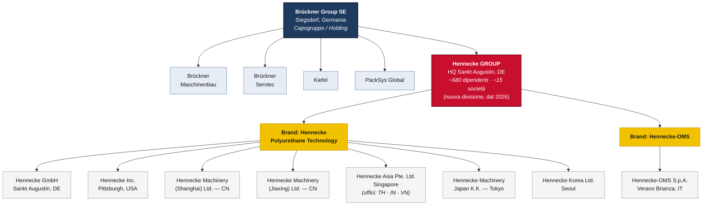
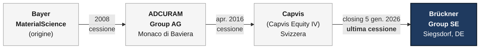

# Hennecke GROUP — Nuovo assetto societario

> **Aggiornamento:** acquisizione del Gruppo Hennecke da parte del **Brückner Group SE**.
> Accordo firmato il **3 dicembre 2025**, perfezionamento del closing il **5 gennaio 2026**.
> Il venditore era un fondo gestito da **Capvis AG** (Svizzera), in precedenza azionista di maggioranza.

Con questa operazione il Gruppo Hennecke entra a far parte del Brückner Group SE, di cui
diventa la quinta divisione (business unit) accanto a Brückner Maschinenbau, Brückner Servtec,
Kiefel e PackSys Global. La struttura interna del Gruppo Hennecke (i due brand di prodotto e
le società controllate) rimane invariata; cambia la proprietà al vertice.

---

## 1. Diagramma del nuovo assetto societario

---

## 2. Cronologia degli assetti proprietari (catena delle cessioni)

---

## 3. Note di sintesi

| Voce | Dettaglio |
|---|---|
| **Nuovo proprietario** | Brückner Group SE (Siegsdorf, Germania) |
| **Quota acquisita** | 100% del Gruppo Hennecke |
| **Venditore** | Fondo gestito da Capvis AG (Svizzera) |
| **Firma accordo** | 3 dicembre 2025 |
| **Closing** | 5 gennaio 2026 |
| **Posizionamento** | Hennecke = nuova/quinta divisione del Brückner Group |
| **Sede Gruppo Hennecke** | Sankt Augustin, Germania |
| **Brand di prodotto** | Hennecke Polyurethane Technology · Hennecke-OMS |
| **Dimensione** | ~680 dipendenti, ~15 società nel mondo |
| **Settore** | Macchine e impianti per la lavorazione del poliuretano (PUR) |

### Fonti
- [Brückner Group acquires Hennecke Group — PU MAGAZINE](https://www.pu-magazine.com/pu/news/meldungen/20251212-brueckner-acquires-hennecke.php)
- [CMS advises Brückner Group on the acquisition of Hennecke Group](https://cms.law/en/deu/news-information/cms-advises-brueckner-group-on-the-acquisition-of-hennecke-group)
- [Hengeler Mueller advises Capvis on sale of Hennecke Group to Brückner Group](https://hengeler-news.com/en/articles/hengeler-mueller-advises-capvis-on-sale-of-hennecke-group-to-brueckner-group)
- [Hennecke-OMS S.p.A. — Hennecke GROUP](https://www.hennecke.com/en/company/worldwide/hennecke-oms)
- [About Us — Brückner Group](https://www.brueckner.com/en/about-us)
- [Adcuram: Verkauf der Hennecke-Gruppe an Finanzinvestor Capvis (2016)](https://www.k-online.de/de/Media_News/News/Archiv_Branchen-News/Adcuram_Verkauf_der_Hennecke-Gruppe_an_Finanzinvestor_Capvis)
