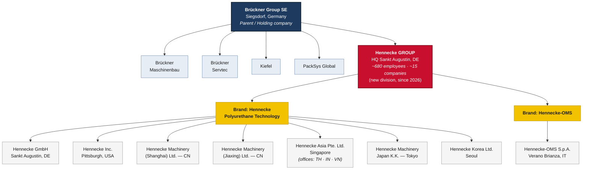
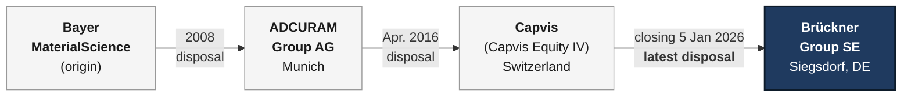

# Hennecke GROUP — New Corporate Structure

> **Update:** acquisition of the Hennecke Group by **Brückner Group SE**.
> Agreement signed on **3 December 2025**, transaction closed on **5 January 2026**.
> The seller was a fund advised by **Capvis AG** (Switzerland), previously the majority shareholder.

With this transaction the Hennecke Group becomes part of Brückner Group SE, joining as its
fifth division (business unit) alongside Brückner Maschinenbau, Brückner Servtec, Kiefel and
PackSys Global. The internal structure of the Hennecke Group (its two product brands and the
controlled companies) remains unchanged; only the ownership at the top changes.

---

## 1. New corporate structure diagram

---

## 2. Ownership timeline (chain of disposals)

---

## 3. Summary notes

| Item | Detail |
|---|---|
| **New owner** | Brückner Group SE (Siegsdorf, Germany) |
| **Stake acquired** | 100% of the Hennecke Group |
| **Seller** | Fund advised by Capvis AG (Switzerland) |
| **Agreement signed** | 3 December 2025 |
| **Closing** | 5 January 2026 |
| **Positioning** | Hennecke = new/fifth division of the Brückner Group |
| **Hennecke Group HQ** | Sankt Augustin, Germany |
| **Product brands** | Hennecke Polyurethane Technology · Hennecke-OMS |
| **Size** | ~680 employees, ~15 companies worldwide |
| **Industry** | Machines and plants for polyurethane (PUR) processing |

### Sources
- [Brückner Group acquires Hennecke Group — PU MAGAZINE](https://www.pu-magazine.com/pu/news/meldungen/20251212-brueckner-acquires-hennecke.php)
- [CMS advises Brückner Group on the acquisition of Hennecke Group](https://cms.law/en/deu/news-information/cms-advises-brueckner-group-on-the-acquisition-of-hennecke-group)
- [Hengeler Mueller advises Capvis on sale of Hennecke Group to Brückner Group](https://hengeler-news.com/en/articles/hengeler-mueller-advises-capvis-on-sale-of-hennecke-group-to-brueckner-group)
- [Hennecke-OMS S.p.A. — Hennecke GROUP](https://www.hennecke.com/en/company/worldwide/hennecke-oms)
- [About Us — Brückner Group](https://www.brueckner.com/en/about-us)
- [Adcuram: Sale of the Hennecke Group to financial investor Capvis (2016)](https://www.k-online.de/de/Media_News/News/Archiv_Branchen-News/Adcuram_Verkauf_der_Hennecke-Gruppe_an_Finanzinvestor_Capvis)
